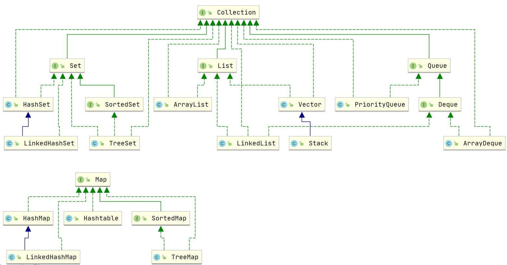

#ArrayList常见面试题 
ArrayList底层主要属性有elementData对象数组  
默认容量为10,每次都扩容原容量的1.5倍,扩容通过位运算右移动1位。  
ArrayList实现了RandomAccess接口,拥有快速随机访问的特性  

##ArrayList如何添加元素效率最高？  
如果在ArrayList初始化时指定合适的数组容量大小，直接添加元素到数组尾部，那么ArrayList 添加元素的效率反而比LinkedList高

##ArrayList在foreach循环或迭代器遍历中，调用自身的remove(E e)方法删除元素，会导致什么问题？  
会抛ConcurrentModificationException异常，原因是集合修改次数modCount和迭代器期望修改次数expectedModCount不一致
foreach循环相当于迭代器，在迭代器遍历中，使用ArrayList自身的remove(E e)方法删除元素，内部会进行modCount++，但并不会进行迭代器的expectedModCount++，因此导致进入下一趟遍历调用迭代器的next()方法中，内部比对两者不一致抛出ConcurrentModificationException异常
目前开发规范都是禁止在迭代器中使用集合自身的remove/add方法，如果要在循环中删除元素，应该使用迭代器的remove删除，也可以使用for循环进行remove删除元素，不过需要角标减1（i--）

##ArrayList 属性elementData数组使用了transient修饰，作用是什么？  
使用transient关键词修饰属性，表示不能被外部方法序列化
ArrayList 的elementData数组是动态扩容的，并非所有被分配的内存空间都存储了数据，如果采用外部序列化法实现序列化，那整个elementData都会被序列化
ArrayList为了避免这些没有存储数据的内存空间被序列化，内部提供了两个私有方法 writeObject 以及 readObject 来自我完成序列化与反序列化，从而在序列化与反序列化数组时节省了空间和时间。

#LinkedList常见面试题:
继承AbstractSequentialList抽象类，实现了List接口，还实现了Deque双向队列以及Cloneable, java.io.Serializable克隆和序列化,JDK1.7后Entry<E> header属性被替换为Node<E> first和Node last`首尾节点属性
https://blog.csdn.net/JustinQin/article/details/119994874

1、hashMap原理

2、HashTable与HashMap的区别  
**相同点**:  
    hashmap和Hashtable都实现了map、Cloneable（可克隆）、Serializable（可序列化）这三个接口   
**不同点**:  
底层数据结构不同:jdk1.7底层都是数组+链表,但jdk1.8 HashMap加入了红黑树
Hashtable 是不允许键或值为 null 的，HashMap 的键值则都可以为 null。
添加key-value的hash值算法不同：HashMap添加元素时，是使用自定义的哈希算法,而HashTable是直接采用key的hashCode()   
实现方式不同：Hashtable 继承的是 Dictionary类，而 HashMap 继承的是AbstractMap类。  
初始化容量不同：HashMap 的初始容量为：16，Hashtable 初始容量为：11，两者的负载因子默认都是：0.75。  
扩容机制不同：当已用容量>总容量 * 负载因子时，HashMap 扩容规则为当前容量翻倍，Hashtable 扩容规则为当前容量翻倍 +1。  
支持的遍历种类不同：HashMap只支持Iterator遍历,而HashTable支持Iterator和Enumeration两种方式遍历  
迭代器不同：HashMap的迭代器(Iterator)是fail-fast迭代器，而Hashtable的enumerator迭代器不是fail-fast的。所以当有其它线程改变了HashMap的结构（增加或者移除元素），将会抛出ConcurrentModificationException，但迭代器本身的remove()方法移除元素则不会抛出ConcurrentModificationException异常。但这并不是一个一定发生的行为，要看JVM。而Hashtable 则不会。  
部分API不同：HashMap不支持contains(Object value)方法，没有重写toString()方法,而HashTable支持contains(Object value)方法，而且重写了toString()方法  
同步性不同: Hashtable是同步(synchronized)的，适用于多线程环境,
而hashmap不是同步的，适用于单线程环境。多个线程可以共享一个Hashtable；而如果没有正确的同步的话，多个线程是不能共享HashMap的。  
https://blog.csdn.net/qq_42848910/article/details/107779037

3、Set直接继承的实现类：HashSet、LinkedHashSet
Set的子接口SortedSet接口---实现类：TreeSet

4、List的直接实现类
LinkedList

Vector

ArrayList

List子接口实现类 Stack

5、Queue的实现类
ArrayQueue(数组队列)
PriorityQueue(优先队列/小根堆)

6、
https://lux-sun.blog.csdn.net/article/details/120453977