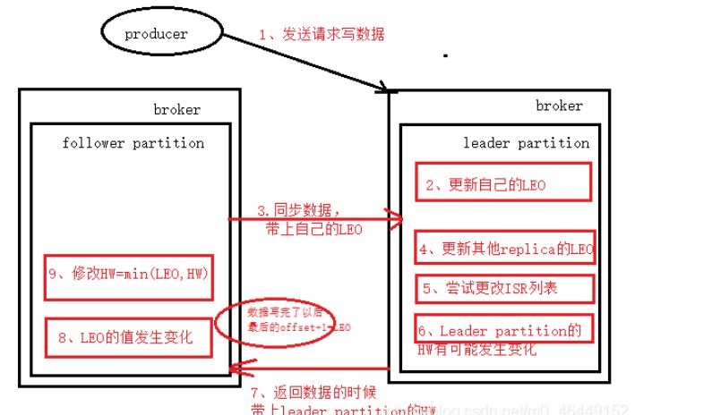

## Kafka
基础&总体  
生产者  
kafka实例broker  
消息者 

基础&总体
-------------
#### 1.什么是kafka?

Apache Kafka是由Apache开发的一种发布订阅消息系统。

#### 2.kafka的3个关键功能？

- 发布和订阅记录流，类似于消息队列或企业消息传递系统。
- 以容错的持久方式存储记录流。
- 处理记录流。

#### 3.kafka通常用于两大类应用？

- 建立实时流数据管道，以可靠地在系统或应用程序之间获取数据
- 构建实时流应用程序，以转换或响应数据流

#### 4.kafka特性?

高吞吐量、低延迟：kafka每秒可以处理几十万条消息，它的延迟最低只有几毫秒；
可扩展性：kafka集群支持热扩展；
持久性、可靠性：消息被持久化到本地磁盘，并且支持数据备份防止数据丢失；
容错性：允许集群中节点故障（若副本数量为n,则允许n-1个节点故障）；
高并发：支持数千个客户端同时读写。

####4.1使用场景
消息队列、行为跟踪、元信息监控、日志收集、流处理、事件源、持久性日志（commit log）

####4.2作为消息队列的优势/缺点
消息队列
系统解耦（降低系统之间耦合度）
异步处理 (将消息存储，异步处理)
流量削峰（抢购秒杀）
日志搜集（大量日志搜集工作）

优势：
吞吐量高
时效性：ms级
可用性：非常高

缺点:
Kafka单机超过64个队列/分区，Load会发生明显的飙高现象，队列越多，load越高，发送消息响应时间变长
使用短轮询方式，实时性取决于轮询间隔时间；
消费失败不支持重试；
支持消息顺序，但是一台代理宕机后，就会产生消息乱序；
社区更新较慢；

#### 5.kafka的5个核心Api?

-  Producer API 
-  Consumer API
-  Streams API :是Kafka提供的一个用于构建流式处理程序的Java库。
-  Connector API:快速定义并实现各种Connector(File,Jdbc,Hdfs等)，这些功能让大批量数据导入/导出Kafka
-  Admin API 

https://blog.csdn.net/helihongzhizhuo/article/details/80335931

#### 9.什么是Topic（主题）?

主题，kafka通过不同的主题却分不同的业务类型的消息记录。

-------------------
生产者 
--------------------
#### 7.什么是Producer（生产者）?
消息的生产者被称为Producer。
Producer将消息发送到集群指定的主题中存储，同时也自定义算法决定将消息记录发送到哪个分区?

---------------------------
kafka实例broker 
---------------------------
#### 6.什么是Broker（代理）?

Kafka集群中，一个kafka实例被称为一个代理(Broker)节点。

--------------------------
消息者
--------------------------
#### 8.什么是Consumer（消费者）?

消息的消费者，从kafka集群中指定的主题读取消息。

#### 10.什么是Partition（分区）?

每一个Topic可以有一个或者多个分区(Partition)。

#### 11.分区和代理节点的关系？

一个分区只对应一个Broker,一个Broker可以管理多个分区。

#### 12.什么是副本(Replication)?

每个主题在创建时会要求制定它的副本数（默认1）。
副本分为两类：领导者副本（Leader Replica）和 追随者副本（Follower Replica）。**每个分区在创建时都要选举一个副本成为领导者副本，其余的副本自动成为追随者副本。

https://blog.csdn.net/qq_41049126/article/details/111408105

#### 13.什么是记录(Record)?

实际写入到kafka集群并且可以被消费者读取的数据。

每条记录包含一个键、值和时间戳。

#### 14.kafka适合哪些场景？

日志收集、消息系统、活动追踪、运营指标、流式处理、时间源等。

#### 15.kafka磁盘选用上？

SSD的性能比普通的磁盘好，这个大家都知道，实际中我们用普通磁盘即可。它使用的方式多是顺序读写操作，一定程度上规避了机械磁盘最大的劣势，即随机读写操作慢，因此SSD的没有太大优势。

#### 16.使用RAID的优势?

- 提供冗余的磁盘存储空间
- 提供负载均衡

#### 17.磁盘容量规划需要考虑到几个因素？

- 新增消息数
- 消息留存时间
- 平均消息大小
- 备份数
- 是否启用压缩

#### 18.Broker使用单个？多个文件目录路径参数？

log.dirs 多个

log.dir 单个

#### 19.一般来说选择哪个参数配置路径？好处？

log.dirs

好处:

提升读写性能，多块物理磁盘同时读写高吞吐。

故障转移。一块磁盘挂了转移到另一个上。

#### 20.自动创建主题的相关参数是?

auto.create.topics.enable

#### 21.解决kafka消息丢失问题？

- 不要使用 producer.send(msg)，而要使用 producer.send(msg, callback)。
- 设置 acks = all。
- 设置 retries 为一个较大的值。
- 设置 unclean.leader.election.enable = false。
- 设置 replication.factor >= 3。
- 设置 min.insync.replicas > 1。
- 确保 replication.factor > min.insync.replicas。
- 确保消息消费完成再提交。

#### 22.如何自定分区策略？

显式地配置生产者端的参数partitioner.class

参数为你实现类的 全限定类名，一般来说实现partition方法即可。

#### 23.kafka压缩消息可能发生的地方？

Producer 、Broker。

#### 24.kafka消息重复问题？

做好幂等。

数据库方面可以（唯一键和主键）避免重复。

在业务上做控制。

#### 25.你知道的kafka监控工具？

- JMXTool 工具
- Kafka Manager
- Burrow
- JMXTrans + InfluxDB + Grafana
- Confluent Control Center

#### 26.kafka follower如何与leader同步数据
LEO（LogEndOffset）：表示每个partition的log最后一条Message的位置。
HW（HighWatermark）：表示partition各个replicas数据间同步且一致的offset位置，即表示all replicas已经commit位置，每个Broker缓存中维护此信息，并不断更新。取一个partitionISR中最小的LEO作为HW，consumer最多只能消费到HW所在位置。Consumer只能看到commit的数据，也就是HW的数据。

Kafka的复制机制既不是完全的同步复制，也不是单纯的异步复制。完全同步复制要求All Alive Follower都复制完，这条消息才会被认为commit，这种复制方式极大的影响了吞吐率。而异步复制方式下，Follower异步的从Leader复制数据，数据只要被Leader写入log就被认为已经commit，这种情况下，如果leader挂掉，会丢失数据，kafka使用ISR的方式很好的均衡了确保数据不丢失以及吞吐率。Follower可以批量的从Leader复制数据，而且Leader充分利用磁盘顺序读以及send file(zero copy)机制，这样极大的提高复制性能，内部批量写磁盘，大幅减少了Follower与Leader的消息量差。

https://yzhyaa.blog.csdn.net/article/details/109699620
https://blog.csdn.net/m0_46449152/article/details/115057392
https://yzhyaa.blog.csdn.net/article/details/109699620

#### 27.什么情况下一个 broker 会从 isr中踢出去

leader会维护一个与其基本保持同步的Replica列表，该列表称为ISR(in-sync Replica)，每个Partition都会有一个ISR，而且是由leader动态维护 ，如果一个follower比一个leader落后太多，或者超过一定时间未发起数据复制请求，则leader将其重ISR中移除 。

**kafa手动提交**
https://blog.csdn.net/bboy66/article/details/124428788

kafka分区
https://mp.weixin.qq.com/s/-BCm6MGyyJdyClNBNpTWdQ

Kafka知识体系
https://mp.weixin.qq.com/s/RvujZl6Ecm30IupyoH0V6Q

#### 参考:

《Kafka并不难学》

《kafka入门与实践》

极客时间：Kafka核心技术与实战

http://kafka.apache.org/

kafka面试题
https://blog.csdn.net/qq_28900249/article/details/90346599

**kafka的消费者流程**：
消息的消费模型有两种，推送模型（push）和拉取模型（pull）

 consumer采用pull（拉）模式从broker中读取数据。
 上面的2种区别：
  - push（推）模式很难适应消费速率不同的消费者，因为消息发送速率是由broker决定的。它的目标是尽可能以最快速度传递消息，但是这样很容易造成consumer来不及处理消息，典型的表现就是拒绝服务以及网络拥塞。而pull模式则可以根据consumer的消费能力以适当的速率消费消息。
- pull模式，consumer可自主控制消费消息的速率，同时consumer可以自己控制消费方式。pull模式不足之处是，如果kafka没有数据，消费者可能会陷入循环中，一直等待数据到达。针对这⼀点， Kafka 的消费者在消费数据时会传⼊⼀个时⻓参数 timeout。如果当前没有数据可供消费，Consumer 会等待⼀段时间之后再返回

拉取流程:
- 确保kafka协调者认可了此次消费，并初始化和协调者的连接。认可很多层次的含义，包括kafka集群是否正常，安全认证是否通过之类。
- 确保分区被分配，除了手动assgin的topic，partition和offset，自动subscribe需要从kafka协调者获取相关元数据，也是发生重平衡事件的来源。
- 确保已经获取拉取的offset，否则为从协调者那重新获取对应groupid的offset，如果获取失败（比如这是一个新的groupid），那么会重置offset，根据配置用最旧或者最新来代替。参考`ConsumerCoordinator`
- 拉取数据，通过拉取每个partition的leader，基于NIO思路拉取数据缓存在内存中；参考`Fetcher`。
- 提交offset，如果开启自动提交offset的功能，那么消费者会在两个情况同步提交offset，（1）重平衡或者和broker心跳超时，参考流程2；（2）消费者关闭。如果是手动提交的话可以采用异步或者同步两种提交方式

https://blog.csdn.net/qq_34886352/article/details/84303860

分区机制、Partition分区分配策略
https://blog.csdn.net/m0_65931372/article/details/125971395

segment文件的组成
https://blog.csdn.net/weixin_70730532/article/details/125219822

消息是如何存入segment以及从segment查询消息

Kafka零拷贝机制
https://blog.csdn.net/yxf19034516/article/details/108518194