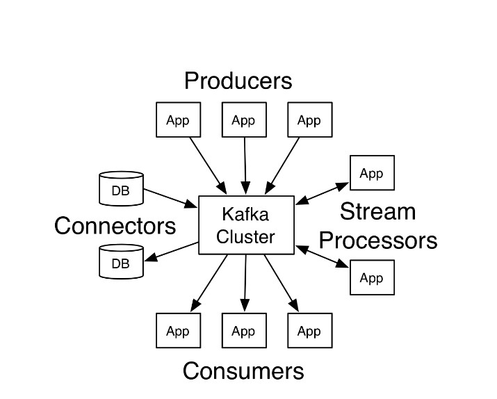

kafka的核心概念：
- broker：kafka集群中包含一个或者多个服务实例（节点），这种服务实例被称为broker（一个broker就是一个节点/一个服务器）；
- topic：每条发布到kafka集群的消息都属于某个类别，这个类别就叫做topic；
- partition：partition是一个物理上的概念，每个topic包含一个或者多个partition,每一个分区内的数据是有序的，但全局的数据不能保证是有序的。（有序是指生产什么样顺序，消费时也是什么样的顺序）
```text
partition replicas（分区副本）：控制消息保存在几个broker（服务器）上，一般情况下副本数等于broker的个数。 一个broker服务下，不可以创建多个副本因子。创建主题时，副本因子应该小于等于可用的broker数。

```

- segment：一个partition当中存在多个segment文件段，每个segment分为两部分，.log文件和 .index 文件，其中 .index 文件是索引文件，主要用于快速查询， .log 文件当中数据的偏移量位置；
- Leader：每个分区多个副本的“主”副本，⽣产者发送数据的对象，以及消费者消费数据的对象，都是  Leader。
- Follower：每个分区多个副本的“从”副本，使用发布订阅模式主动拉取Leader的数据（与redis不同），实时从 Leader 中同步数据，保持和 Leader 数据的同步。Leader 发⽣故障时，某个 Follower 还会成为新的 Leader。
- Offset：消费者消费的位置信息，监控数据消费到什么位置，当消费者挂掉再重新恢复的时候，可以从消费位置继续消费
- Message：每⼀条发送的消息主体
- producer：消息的生产者，负责发布消息到 kafka 的 broker 中；
- consumer：消息的消费者，向 kafka 的 broker 中读取消息的客户端；
- consumer group：消费者组，每一个 consumer 属于一个特定的 consumer group（可以为每个consumer指定 groupName）,每个消费者组都有一个ID，即group ID；

架构图：



Kafka 知识体系保姆级教程宝典:
https://blog.csdn.net/weixin_70730532/article/details/125219822

kafka生产者和消费者流程:
https://blog.csdn.net/m0_65931372/article/details/125971395


24.kafka消息重复问题？  
1、为啥会产生重复消息
底层根本原因：已经消费了数据，但是offset没提交。

2、解决方法


数据重复、数据丢失、消息顺序保证三大问题：
https://blog.csdn.net/m0_37739193/article/details/117391647

数据丢失：
哪些环节可能丢消息？
消息生产者、broker、消息消费者。
消息生产者侧:
```text
网络波动----使用重试props.put("retries", "10");
发送消息无 ack 确认; 发送消息失败无回调，无日志-----设置acks=1 或者 acks=all。发送消息设置回调

参数ack：
acks=0：不需要等待服务器的确认. 这是 retries 设置无效. 响应里来自服务端的 offset 总是 -1，producer只管发不管发送成功与否。延迟低，容易丢失数据。
acks=1：表示 leader 写入成功（但是并没有刷新到磁盘）后即向 producer 响应。延迟中等，一旦 leader 副本挂了，就会丢失数据。
acks=all：等待数据完成副本的复制, 等同于 -1. 假如需要保证消息不丢失, 需要使用该设置. 同时需要设置 unclean.leader.election.enable 为 true, 保证当 ISR 列表为空时, 选择其他存活的副本作为新的 leader.
```

broker侧：
```text
机子宕机/掉电，消息会丢失。因为数据仍在内存里，内存RAM 掉电后就会丢失数据。
----------使用带蓄电池后备电源的缓存 cache，防止系统断电异常
----------其多副本机制： 一般副本数 3 个（配置参数：replication.factor=3)

```


消费者侧：
```text
消息堆积----------提高客户端的消费速度
没有自动提交--------取消自动提交 auto.commit = false，改为手动提交offset
心跳超时，引发 Rebalanc,如果只有这一个客户端，那消息就不会被消费--------
v0.10.2之前版本的客户端：Consumer没有独立线程维持心跳，而是把心跳维持与poll接口耦合在一起。其结果就是，如果用户消费出现卡顿，就会导致Consumer心跳超时，引发Rebalance。
v0.10.2及之后版本的客户端：如果消费时间过慢，超过一定时间（max.poll.interval.ms设置的值，默认5分钟）未进行poll拉取消息，则会导致客户端主动离开队列，而引发Rebalance

```
参考：
https://help.aliyun.com/document_detail/154454.html
https://mp.weixin.qq.com/s/mZptTnuFuafB_hLzwIpShw

如何确保消息不丢失？
https://mp.weixin.qq.com/s/mZptTnuFuafB_hLzwIpShw