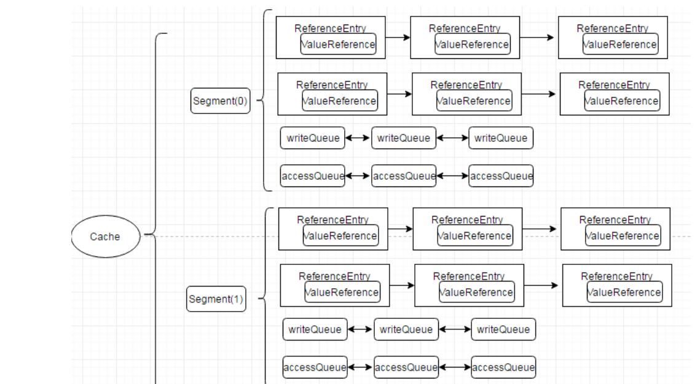
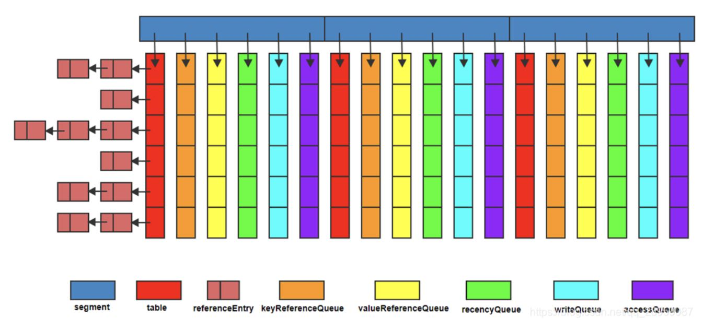

https://dragon.blog.csdn.net/article/details/81907022?spm=1001.2101.3001.6650.4&utm_medium=distribute.pc_relevant.none-task-blog-2%7Edefault%7ECTRLIST%7ERate-4-81907022-blog-114673408.t0_edu_mlt&depth_1-utm_source=distribute.pc_relevant.none-task-blog-2%7Edefault%7ECTRLIST%7ERate-4-81907022-blog-114673408.t0_edu_mlt&utm_relevant_index=9

一、Guava Cache适用场景  
1、你愿意消耗一部分内存来提升速度； 
2、你已经预料某些值会被多次调用；  
3、缓存数据不会超过内存总量；  
4、数据允许不时时一致  
5、适用与数据数据新增加不修改的场景  
Guava Cache是一个全内存的本地缓存实现，它提供了线程安全的实现机制。整体上来说Guava cache 是本地缓存的不二之选，简单易用，性能好。  


一、Guava Cache 的优势
缓存过期和淘汰机制  
在GuavaCache中可以设置Key的过期时间，包括访问过期和创建过期
GuavaCache在缓存容量达到指定大小时，采用LRU的方式，将不常使用的键值从Cache中删除
并发处理能力  
GuavaCache类似CurrentHashMap，是线程安全的。
提供了设置并发级别的api，使得缓存支持并发的写入和读取
采用分离锁机制，分离锁能够减小锁力度，提升并发能力
分离锁是分拆锁定，把一个集合看分成若干partition, 每个partiton一把锁。ConcurrentHashMap就是分了16个区域，这16个区域之间是可以并发的。GuavaCache采用Segment做分区。
更新锁定  
一般情况下，在缓存中查询某个key，如果不存在，则查源数据，并回填缓存。（Cache Aside Pattern）在高并发下会出现，多次查源并重复回填缓存，可能会造成源的宕机（DB），性能下降
GuavaCache可以在CacheLoader的load方法中加以控制，对同一个key，只让一个请求去读源并回填缓存，其他请求阻塞等待。
集成数据源  
一般我们在业务中操作缓存，都会操作缓存和数据源两部分GuavaCache的get可以集成数据源，在从缓存中读取不到时可以从数据源中读取数据并回填缓存监控缓存加载/命中情况统计  


guava的重要组件
1.CacheBuilder 缓存构建器:构建缓存的入口，指定缓存配置参数并初始化本地缓存。采用构建者模式提供了设置好各种参数的缓存对象。  
2、LocalCache数据结构。缓存核心类LocalCache数据结构与ConcurrentHashMap很相似，由多个segment组成，且各segment相对独立，互不影响，所以能支持并行操作，每个segment由一个table和若干队列组成。缓存数据存储在table中，其类型为AtomicReferenceArray。




二、Guava提供两种不同的方法来加载数据：
CacheLoader：在build cache的时候定义一个CacheLoader来获取数据，适用的情况：有固定的方式可以根据key来加载或计算value的值，比如从数据库中获取数据
 ```java
//生成本地缓存，初始化为1000，最大为10000，当超过10000时就会使用LRU算法（最小使用算法）进行清除，有效期是12小时
private static LoadingCache<String,String> localCach = CacheBuilder
.newBuilder()
.initialCapacity(1000)
//缓存有效期12小时
.maximumSize(10000)
.expireAfterAccess(12, TimeUnit.HOURS)  
 .build(new CacheLoader<String, String>() {
                //默认的数据加载实现,当调用get取值的时候,如果key没有对应的值,就调用这个方法进行加载.
                @Override
                public String load(String s) throws Exception {
                    return "null";
                }
            });
```

CacheLoader ----自动加载的原理：在get数据时，如果不存在数据回调用复写load加载，一般通过load方式加载数据库中的数据  


Callable：在get的时候传入一个Callable对象，适用的情况：如果从缓存中获取不到数据，则另外计算一个出来，并把计算结果加入到缓存中

参数解析：
concurrencyLevel


----使用方式
插入：LoadingCache.put()
缓存元素也可以通过Cache.put方法直接插入，但自动加载(CacheLoader)是首选的，因为它可以更容易地推断所有缓存内容的一致性。

获取：LoadingCache.get(K)/getUnchecked(K)
从LoadingCache查询的正规方式是使用get(K)方法。这个方法要么返回已经缓存的值，要么使用CacheLoader向缓存原子地加载新值。由于CacheLoader可能抛出异常，LoadingCache.get(K)也声明为抛出ExecutionException异常。如果你定义的CacheLoader没有声明任何检查型异常，则可以通过getUnchecked(K)查找缓存；但必须注意，一旦CacheLoader声明了检查型异常，就不可以调用getUnchecked(K)。


三、缓存回收方式,删除数据-回收
---被动删除机制
1、基于容量的回收（size-based eviction），有两种方式，接近最大的size或weight时回收：
基于maximumSize(long)：一个数据项占用一个size单位，适用于value是固定大小的情况
基于maximumWeight(long)：对不同的数据项计算weight，适用于value不定大小的情况，比如value为Map类型时，可以把map.size()作为weight
回收算法采用的是LRU算法。
2、定时回收（Timed Eviction）：
expireAfterAccess(long, TimeUnit)：缓存项在给定时间内没有被读/写，则回收。----LRU
expireAfterWrite(long, TimeUnit)：缓存项在给定时间内没有被写访问（创建或覆盖），则回收。
3、基于引用的回收（Reference-based Eviction），通过使用弱引用的键或值、或软引用的值，把缓存设置为允许垃圾回收器回收：
CacheBuilder.weakKeys()：使用弱引用存储键。当键没有其它（强或软）引用时，缓存项可以被GC回收
CacheBuilder.weakValues()：使用弱引用存储值。当值没有其它（强或软）引用时，缓存项可以被GC回收
CacheBuilder.softValues()：使用软引用存储值。软引用只有在响应内存需要时，才按照全局最近最少使用的顺序回收。影响性能，不推荐使用。


----主动删除机制
4、显式清除（invalidate）
个别清除：Cache.invalidate(key)
批量清除：Cache.invalidateAll(keys)
清除所有缓存项：Cache.invalidateAll()


清理缓存情况
1、使用CacheBuilder构建的缓存不会"自动"执行清理和回收工作，也不会在某个缓存项过期后马上清理，也没有诸如此类的清理机制。相反，它会在写操作时顺带做少量的维护工作，或者偶尔在读操作时做（如果写操作实在太少的话）。
这样做的原因在于：如果要自动地持续清理缓存，就必须有一个线程，这个线程会和用户操作竞争共享锁。此外，某些环境下线程创建可能受限制，这样CacheBuilder就不可用了。
相反，我们把选择权交到你手里。如果你的缓存是高吞吐的，那就无需担心缓存的维护和清理等工作。如果你的 缓存只会偶尔有写操作，而你又不想清理工作阻碍了读操作，那么可以创建自己的维护线程，以固定的时间间隔调用Cache.cleanUp()。ScheduledExecutorService可以帮助你很好地实现这样的定时调度。

2、但在GuavaCache中，并不存在任何线程！它实现机制是在写操作时顺带做少量的维护工作（如清除），偶尔在读操作时做（如果写操作实在太少的话），也就是说在使用的是调用线程

3、GuavaCache的实现代码中没有启动任何线程！！Cache中的所有维护操作，包括清除缓存、写入缓存等，都是通过调用线程来操作的。这在需要低延迟服务场景中使用时尤其需要关注，可能会在某个调用的响应时间突然变大。
  GuavaCache毕竟是一款面向本地缓存的，轻量级的Cache，适合缓存少量数据。如果你想缓存上千万数据，可以为每个key设置不同的存活时间，并且高性能，那并不适合使用GuavaCache


expireAfterWrite 与 refreshAfterWrite区别
expireAfterWrite
在缓存更新后某个时间失效缓存，这里Guava内部会对某个时间点失效的缓存做统一失效，只要有get访问任一key，就会失效当前时间失效的缓存，会移除当前key。所以这里也希望我们创建的缓存数据量不宜过大，使用guavaCache最好是设置一下maximumSize，避免出现内存溢出的情况。失效后需要获取新值才可会返回。

refreshAfterWrite
是指在创建缓存后，如果经过一定时间没有更新或覆盖，则会在下一次获取该值的时候，会在后台异步去刷新缓存，如果新的缓存值还没有load到时，则会先返回旧值。这里跟上面的expireAfterWrite不同的是，及时到了该刷新的时间，不会失效旧值和移除对应key。在后台异步刷新的过程中，如果当前是刷新状态，及时有其他线程访问到旧值，依然只有一个线程在更新，不会出现多个线程同时刷新同一个key的缓存。


五、一般的缓存失效策略
当缓存需要被清理时（比如空间占用已经接近临界值了），需要使用某种淘汰算法来决定清理掉哪些数据。常用的淘汰算法有下面几种：
FIFO：First In First Out，先进先出。判断被存储的时间，离目前最远的数据优先被淘汰。
LRU：Least Recently Used，最近最少使用。判断最近被使用的时间，目前最远的数据优先被淘汰。
1、新数据插入到链表头部；
2、每当缓存命中（即缓存数据被访问），则将数据移到链表头部；
3、当链表满的时候，将链表尾部的数据丢弃
LFU：Least Frequently Used，最不经常使用。在一段时间内，数据被使用次数最少的，优先被淘汰。
算法根据数据的历史访问频率来淘汰数据，其核心思想是“如果数据过去被访问多次，那么将来被访问的频率也更高”。
LFU的每个数据块都有一个引用计数，所有数据块按照引用计数排序，具有相同引用计数的数据块则按照时间排序。
具体实现如下：
1、新加入数据插入到队列尾部（因为引用计数为1）；
2、队列中的数据被访问后，引用计数增加，队列重新排序；
3、当需要淘汰数据时，将已经排序的列表最后的数据块删除。

六、LRU和LFU实现 
1、LRU实现
利用LinkedHashMap。 用这个类有两大好处：一是它本身已经实现了按照访问顺序的存储，也就是说，最近读取的会放在最前面，最最不常读取的会放在最后（当然，它也可以实现按照插入顺序存储）。
第二，LinkedHashMap本身有一个方法用于判断是否需要移除最不常读取的数，但是，原始方法默认不需要移除（这是，LinkedHashMap相当于一个linkedlist），所以，我们需要override这样一个方法，使得当缓存里存放的数据个数超过规定个数后，就把最不常用的移除掉。


移除监听器
同步监听器：通过CacheBuilder.removalListener(RemovalListener)，你可以声明一个监听器，以便缓存项被移除时做一些额外操作。缓存项被移除时，RemovalListener会获取移除通知[RemovalNotification]，其中包含移除原因[RemovalCause]、键和值

异步监听器：默认情况下，监听器方法是在移除缓存时同步调用的。因为缓存的维护和请求响应通常是同时进行的，代价高昂的监听器方法在同步模式下会拖慢正常的缓存请求。在这种情况下，你可以使用RemovalListeners.asynchronous(RemovalListener, Executor)把监听器装饰为异步操作

guava的刷新
refreshAfterWrite只阻塞回源线程，其他线程返回旧值。  
刷新和回收不太一样。正如LoadingCache.refresh(K)所声明，刷新表示为键加载新值，这个过程可以是异步的。在刷新操作进行时，缓存仍然可以向其他线程返回旧值，而不像回收操作，读缓存的线程必须等待新值加载完成
重载CacheLoader.reload(K, V)可以扩展刷新时的行为，这个方法允许开发者在计算新值时使用旧的值。默认是同步刷新的，也可以改成异步刷新


总结：
guava 如何解决缓存的三大问题
1、缓存击穿--访问不存在的数据情况
- 少量对于访问缓存中不存在的数据，guava回去数据库加载回填至缓存。对于大量访问，只有允许一个线程去数据库加载数据,其他的线程访问时候的会遇到该key是处于isLoading，不会加载数据库。

一般方案：


2、缓存穿透 --一个数据过期场景
采用数据预热+刷新时间小于过期时间

一般方案：
缓存空值并且设置快速过期的方式来作为一个兜底的方案----不知道是不是兜底的方案
布隆过滤器
前置拦截
限流

https://baijiahao.baidu.com/s?id=1688720168018641092&wfr=spider&for=pc
3、缓存雪崩 ---所有的缓存过期
1、使用guava缓存时，通过key类型的隔离，设置不同的过期时间。根据key的不同类型或者key是在不同数据库表加载
2、如果大量访问选择限流。

https://cloud.tencent.com/developer/article/2102426
guava内部实现逻辑：
https://blog.csdn.net/qq_28959087/article/details/105467113

https://dragon.blog.csdn.net/article/details/81907022


https://blog.csdn.net/weixin_44795847/article/details/123702038

https://blog.csdn.net/aitangyong/article/details/53504253

LoadingCache
https://blog.csdn.net/qq_41773026/article/details/119487109


