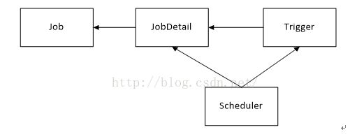

1、Quartz是做什么用的？Quartz框架主要核心组件包括那几部分，分别作用是什么？
1）Quartz是一个由java编写的开源分布式作业调度框架，简单来说，Quartz就是启动定时任务的框架，像linux系统中的corntab，可以定时启动任务。
2）Quartz框架主要核心组件包括调度器、触发器、作业。调度器作为作业的总指挥，触发器作为作业的操作者，作业为应用的功能模块。
（ Job为作业的接口，为任务调度的对象；JobDetail用来描述Job的实现类及其它相关的静态信息；Trigger做为作业的定时管理工具，一个Trigger只能对应一个作业实例，而一个作业实例可对应多个触发器；Scheduler做为定时任务容器，是quartz最上层的东西，它提携了所有触发器和作业，使它们协调工作，每个Scheduler都存有JobDetail和Trigger的注册，一个Scheduler中可以注册多个JobDetail和多个Trigger。）
https://blog.51cto.com/u_15553139/5177868

1、Quartz的体系结构  
调度器Scheduler：Scheduler为定时任务调度，它会将任务Job及触发器Trigger整合起来，负责基于Trigger设定的时间来执行Job 
触发器Trigger：执行任务的触发器，包含两个SimpleTrigger和CronTrigger两种 
JobDetail:JobDetail 用来保存作业Job的详细信息。一个JobDetail可以有多个Trigger，但是一个Trigger只能对应一个JobDetail，
任务Job：实现的任务类，每一个job必须实现org.quartz.job接口，且只需实现接口定义的execute()方法

https://www.cnblogs.com/sanmuqingliang/p/11646370.html

2、Quartz持久化时涉及的表
 QRTZ_FIRED_TRIGGERS;
 QRTZ_PAUSED_TRIGGER_GRPS;
 QRTZ_SCHEDULER_STATE;
 QRTZ_LOCKS;
 QRTZ_SIMPLE_TRIGGERS;
 QRTZ_SIMPROP_TRIGGERS;
 QRTZ_CRON_TRIGGERS;
 QRTZ_BLOB_TRIGGERS;
 QRTZ_TRIGGERS;
 QRTZ_JOB_DETAILS;
 QRTZ_CALENDARS;
