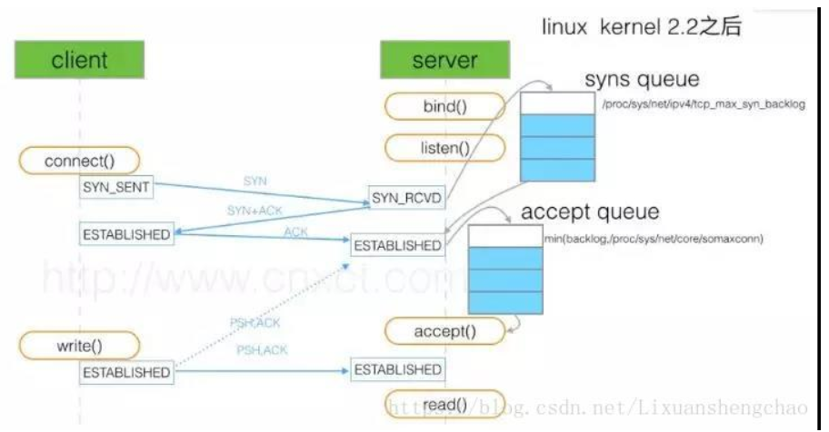

TCP/IP详解--TCP中异常关闭连接的意义 异常关闭的情况  
https://blog.csdn.net/yusiguyuan/article/details/22515921

TCP中的RST标志(Reset)详解 
https://blog.csdn.net/a_tu_/article/details/80389878

接收RST回应的几种情况
https://blog.csdn.net/yusiguyuan/article/details/22885667

linux tcp GSO和TSO实现
https://blog.csdn.net/weixin_33805557/article/details/93328586

tcpdump丢包问题分析
https://blog.csdn.net/liuruiqun/article/details/50531830

网络中出现TCP、UDP粘包、分包的两点解决办法
https://blog.csdn.net/cherish_2012/article/details/41681853

Linux 的内核调优tcp
https://blog.csdn.net/Lixuanshengchao/article/details/81606168

FAQ:
1.为什么客户端在TIME-WAIT阶段要等2MSL?
为的是确认服务器端是否收到客户端发出的ACK确认报文。
当客户端发出最后的ACK确认报文时，并不能确定服务器端能够收到该段报文。所以客户端在发送完ACK确认报文之后，会设置一个时长为2MSL的计时器。MSL指的是Maximum Segment Lifetime：一段TCP报文在传输过程中的最大生命周期。2MSL即是服务器端发出为FIN报文和客户端发出的ACK确认报文所能保持有效的最大时长。
服务器端在1MSL内没有收到客户端发出的ACK确认报文，就会再次向客户端发出FIN报文；
• 如果客户端在2MSL内，再次收到了来自服务器端的FIN报文，说明服务器端由于各种原因没有接收到客户端发出的ACK确认报文。客户端再次向服务器端发出ACK确认报文，计时器重置，重新开始2MSL的计时；否则客户端在2MSL内没有再次收到来自服务器端的FIN报文，说明服务器端正常接收了ACK确认报文，客户端可以进入CLOSED阶段，完成“四次挥手”。
所以，客户端要经历时长为2SML的TIME-WAIT阶段；这也是为什么客户端比服务器端晚进入CLOSED阶段的原因

2、为什么TIME_WAIT状态还需要等2MSL后才能返回到CLOSED状态？
这是因为虽然双方都同意关闭连接了，而且握手的4个报文也都协调和发送完毕，按理可以直接回到CLOSED状态（就好比从SYN_SEND状态到ESTABLISH状态那样）；但是因为我们必须要假想网络是不可靠的，你无法保证你最后发送的ACK报文会一定被对方收到，因此对方处于LAST_ACK状态下的Socket可能会因为超时未收到ACK报文，而重发FIN报文，所以这个TIME_WAIT状态的作用就是用来重发可能丢失的ACK报文。

3．TIME_WAIT状态还需要等2MSL后才能返回到CLOSED状态会产生什么问题
通信双方建立TCP连接后，主动关闭连接的一方就会进入TIME_WAIT状态，TIME_WAIT状态维持时间是两个MSL时间长度，也就是在1-4分钟，Windows操作系统就是4分钟。进入TIME_WAIT状态的一般情况下是客户端，一个TIME_WAIT状态的连接就占用了一个本地端口。一台机器上端口号数量的上限是65536个，如果在同一台机器上进行压力测试模拟上万的客户请求，并且循环与服务端进行短连接通信，那么这台机器将产生4000个左右的TIME_WAIT Socket，后续的短连接就会产生address already in use : connect的异常，如果使用Nginx作为方向代理也需要考虑TIME_WAIT状态，发现系统存在大量TIME_WAIT状态的连接，通过调整内核参数解决。
vi /etc/sysctl.conf
编辑文件，加入以下内容：
net.ipv4.tcp_syncookies = 1
net.ipv4.tcp_tw_reuse = 1
net.ipv4.tcp_tw_recycle = 1
net.ipv4.tcp_fin_timeout = 30
然后执行 /sbin/sysctl -p 让参数生效。
net.ipv4.tcp_syncookies = 1 表示开启SYN Cookies。当出现SYN等待队列溢出时，启用cookies来处理，可防范少量SYN攻击，默认为0，表示关闭；
net.ipv4.tcp_tw_reuse = 1 表示开启重用。允许将TIME-WAIT sockets重新用于新的TCP连接，默认为0，表示关闭；
net.ipv4.tcp_tw_recycle = 1 表示开启TCP连接中TIME-WAIT sockets的快速回收，默认为0，表示关闭。
net.ipv4.tcp_fin_timeout 修改系統默认的TIMEOUT时间

