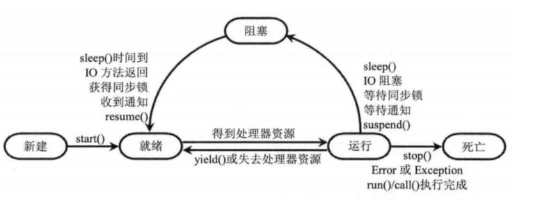
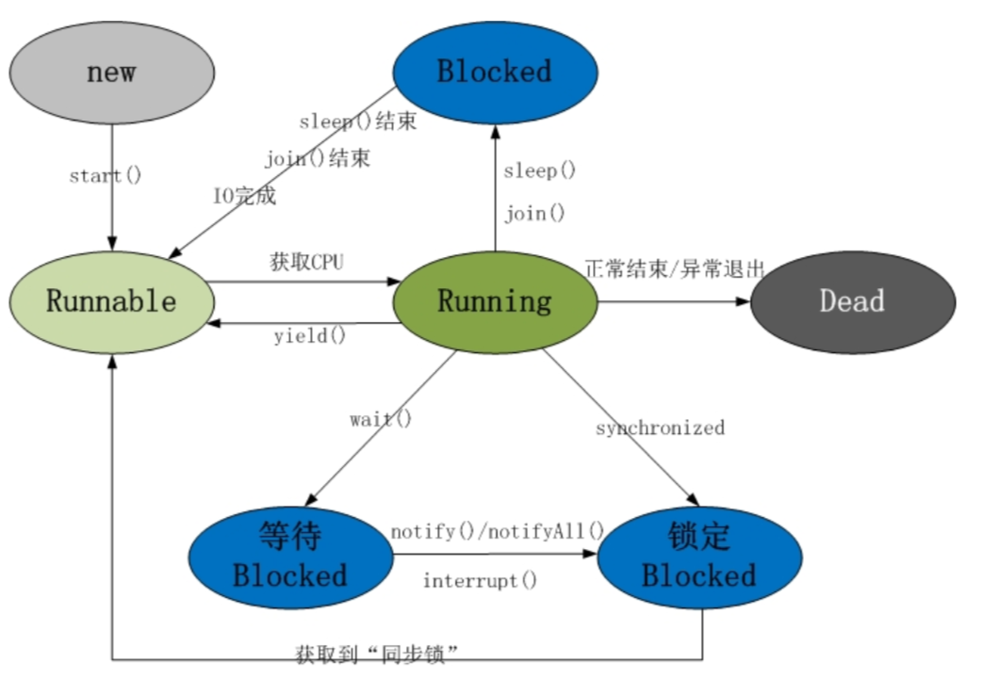

#线程是实现方式
##单个线程
1、实现 Runnable 接口  
2、继承 Thread 类(也是实现Runnable 接口)   
3、使用Callable和Future  
##线程池


#线程的状态&生命周期


阻塞状态再细分：


阻塞状态（Blocked）：处于运行状态中的线程由于某种原因，暂时放弃对CPU的使用权，停止执行，此时进入阻塞状态，直到其进入到就绪状态，才有机会再次被CPU调用以进入到运行状态。  
根据阻塞产生的原因不同，阻塞状态又可以分为三种：  
1.等待阻塞：运行状态中的线程执行wait()方法，使本线程进入到等待阻塞状态；  
2.同步阻塞 -- 线程在获取synchronized同步锁失败(因为锁被其它线程所占用)，它会进入同步阻塞状态；  
3.其他阻塞 -- 通过调用线程的sleep()或join()或发出了I/O请求时，线程会进入到阻塞状态。当sleep()状态超时、join()等待线程终止或者超时、或者I/O处理完毕时，线程重新转入就绪状态。  


#FAQ:
1、wait()方法&sleep()方法&join()区别  
- sleep():Thread静态方法,Thread.sleep();当在一个Synchronized块中调用Sleep()方法是，线程虽然休眠了，但是对象锁并没有被释放，其他线程无法访问这个对象（即使睡着也持有对象锁)  
- wait(): 基类Object的final native方法，调用会释放当前对象锁(monitor),这样其他线程可以继续进入对象的同步方法。用于线程间协作。
- join(): Thread对象方法；join()就是通过wait()实现的。


2、线程中断,Java中断机制是一种协作机制。通过中断并不能直接终止另一个线程，而需要被中断的线程自己处理中断（中断一个线程只是为了引起该线程的注意，被中断线程可以决定如何应对中断)。
- interrupted(): Thread类的public static boolean interrupted(),测试当前线程是否已经中断。线程的中断状态 由该方法清除。换句话说，如果连续两次调用该方法，则第二次调用将返回 false（在第一次调用已清除了其中断状态之后，且第二次调用检验完中断状态前，当前线程再次中断的情况除外。
- isInterrupted(): Thread类的public boolean isInterrupted;测试线程是否已经中断。线程的中断状态不受该方法的影响。
- interrupt(): Thread类的public static boolean interrupted();底层调用的Thread类的isInterrupted方法。设置中断标识为为true。
- 普遍用法
``` java
public void run() {
    try {
        ...
        /*
         * 不管循环里是否调用过线程阻塞的方法如sleep、join、wait，这里还是需要加上
         * !Thread.currentThread().isInterrupted()条件，虽然抛出异常后退出了循环，显
         * 得用阻塞的情况下是多余的，但如果调用了阻塞方法但没有阻塞时，这样会更安全、更及时。
         */
        while (!Thread.currentThread().isInterrupted()&& more work to do) {
            do more work 
        }
    } catch (InterruptedException e) {
        //线程在wait或sleep期间被中断了
    } finally {
        //线程结束前做一些清理工作
    }
}
```


3、线程中断的异常InterruptedException  
- 正常状态的线程，在调用interrupt方法时，并不会抛出InterruptedException，而是设置一个中断状态，这个中断状态会在何时的时候起作用，也就是中断线程，具体什么时候，我们看下《java并发编程实战》中说的：
然而如果线程处于wait，sleep，join三个方法时候，则会抛出InterruptedException
- 处理InterruptedException  
（1）不做处理，直接抛出;直接抛出并不会影响线程的状态，被中断的线程还是会提前结束中断状态，继续执行  
（2）捕获异常，再次调用interrupt方法，将中断状态重新设置为true；Thread.currentThread().interrupt();这样就保留了线程原有的状态，让线程继续等待下去  
（3）捕获异常，不处理；（不推荐）  
-  interrrupted() 只清除中断状态,不建议使用


4 中断应用(参考https://www.cnblogs.com/onlywujun/p/3565082.html)
- 使用中断信号量中断非阻塞状态的线程
- 使用thread.interrupt()中断非阻塞状态线程
- 使用thread.interrupt()中断阻塞状态线程
- 死锁状态线程无法被中断
- 中断I/O操作


#参考
https://www.cnblogs.com/onlywujun/p/3565082.html
https://www.cnblogs.com/java1024/archive/2019/11/28/11950129.html
https://blog.csdn.net/chengmaoning/article/details/73129285


