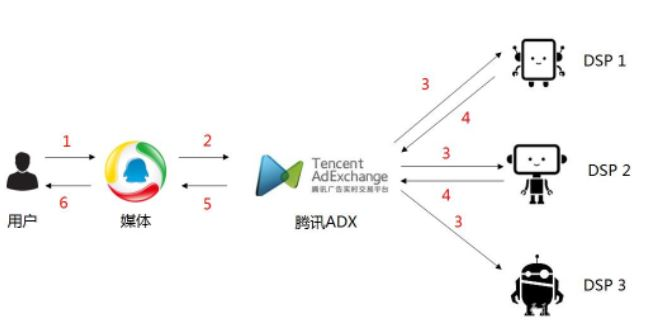

程序化购买广告解析
https://www.cnblogs.com/zdz8207/p/7128077.html
https://zhuanlan.zhihu.com/p/78416923

SSP (全称Supply-Side Platform)，即供应方平台，是服务于媒体端的广告平台。与DSP、DMP、Ad Exchang等共同构成广告技术生态体系

实时竞价RTB:
指用户在访问媒体产生曝光机会时，众多家DSP根据曝光的上下文以及用户属性实时地评估曝光价值并给出报价，经过ADX竞价后最终出价最高的广告主赢得此次曝光机会

保价保量PDB:
保价保量(Programmatic Direct Buying, PDB):在广告投放前，根据广告主的投放需求，按照固定的CPM价格、固定的资源位、固定的预定量在媒体进行下单，在广告投放过程中，当用户在访问媒体产生曝光机会时，腾讯ADX根据广告主的预定量将广告请求发给单个需求方，需求方根据N倍推送约定的规则有选择的挑选和回退流量，且无需进行竞价

保价不保量PD:
优选购买 (preferred deal，PD) 是指在广告投放前，根据广告主的投放需求，按照固定的CPM价格和固定的资源位在媒体进行下单，在广告投放过程中，当用户在访问媒体产生曝光机会时，腾讯ADX将广告请求发给单个需求方，需求方可以按照自己的意愿挑选流量，且无需进行竞价

需求方平台（DSP）:
DSP 作为程序化购买市场中的核心环节， 将会成为未来 2-3 年内发展最快的产业链环节，其重要的原因在于 DSP 的商业模式不但可以有效地提升流量价值，**同时实时、便捷、自动化的投放体系也使其面对海量的广告需求可以更高效的完成投放任务**，在未来的网络广告市场发展过程中， DSP 将扮演重要的环节。未来 DSP 市场竞争将格外激烈，作为产业链必争环节，未来将得以高速的发展。

广告交易平台（Ad Exchange）
广告交易平台是能够将媒体和广告主/广告代理商联系在一起的在线广告交易市场，按照是否公开可以分为公有广告交易平台与私有广告交易平台 ：公有广告交易平台上的广告位资源一般来自不同媒体，而私有广告交易平台上的广告位资源则通常来自单一媒体。

公开广告交易平台（ Public Ad Exchange）的运营商以互联网巨头为主， 由于公开交易平台需要汇集大量的媒体，因此往往是网络媒体巨头才能成为公开广告交易平台的运营商。公开广告交易平台上的媒体资源以运营商的媒体合作伙伴资源为主，但同时也可以有运营商自有媒体上的广告位资源。当前国内公开广告交易平台的代表主要包括百度、阿里妈妈以及谷歌。它们此前均已运营网站联盟多年，拥有大量的媒体合作伙伴，因此在运营公开广告交易平台上具有天然的优势。此外，市场上也有其它一些拥有一定数量媒体合作伙伴的公司搭建了一些相对小型的公开广告交易平台，拥有一些独有的资源。

私有广告交易平台（ Private Ad Exchange） 的运营商以大型门户和视频网站为主。 相比将自身资源放在公开广告交易平台出售，大型媒体集团倾向于搭建私有广告交易平台，将自己的广告位资源单独出售，以提升对自有媒体资源出售的控制力。 如国际媒体巨头新闻集团通过与 Rubicon Project 合作，搭建私有交易平台；国内以大型门户媒体如腾讯、新浪、搜狐，以及视频网站如优酷土豆、爱奇艺、PPTV、暴风科技等为代表，搭建自身私有交易平台

供应方平台（SSP）：
媒体的广告投放进行全方位的分析和管理的平台，是媒体优化自身收益的工具。 SSP 的主要功能在于帮助媒体对自身不同的广告位进行管理

其功能包括：一、 管理广告位的分配，针对自身广告位的特点，选择是内部销售还是开放给广告交易平台，对于开放的广告位则需进一步管理是分配给哪个广告交易平台；二、筛选来自不同广告交易平台的广告请求，筛选广告主、监控广告素材；三、管理广告位价格，通过数据的积累对每个不同广告位的广告底价进行分析和调整。

数据管理平台（DMP）：
DMP 可以实现收集、存储、集中、分析、挖掘以及运用原先隔离而分散的数据；掌控自有的企业用户数据以及营销活动数据，并使用这些数据进行决策和创新，以便更多更精准地推送广告，获得更好的广告投放回报